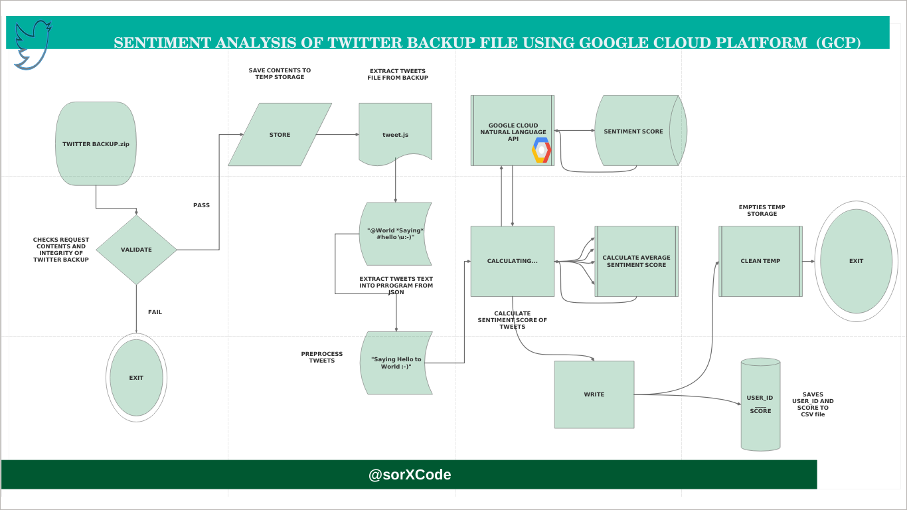

# SENTIMENT SCORE

This program runs sentiment analysis on tweets from twitter backup file using Google Cloud Natural Language Toolkit. The scores are saved in the current directory in a csv format. The last entry in the csv is the average sentiment score of the entire tweets history.

# Requirements
- python3
- pandas>=0.24.2
- google-cloud-language==1.2.0
- visit [Google_Application_Credentials](https://cloud.google.com/docs/authentication/getting-started) page for procedures to obtain credentials. 

# Usage
**Set Environment Variable**

Replace [PATH] with the file path to the credentials file.

For LINUX or MACOS, run

`export GOOGLE_APPLICATION_CREDENTIALS="[PATH]"`

For WINDOWS, run

`set GOOGLE_APPLICATION_CREDENTIALS=[PATH]`

After setting Google Application Credentials as environment variable, run:

`python3 main.py [backupfile.zip]`

# Flowchart

